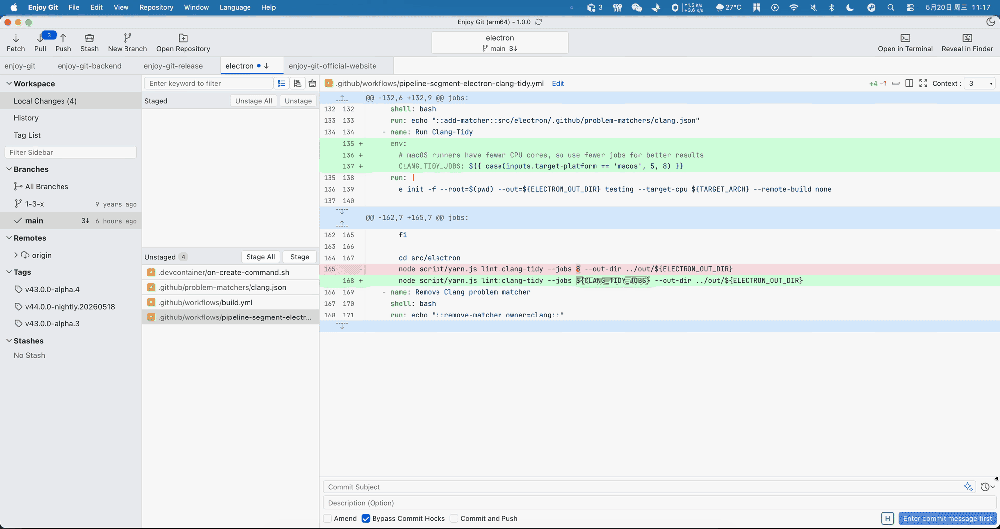

<p align="center">
  
</p>

[English](./README.en.md) | 简体中文 | [繁體中文](./README.zh-HK.md)

# [官网](https://enjoygit.com) · [隐私政策](https://enjoygit.com/privacyPolicy.html)

# Enjoy Git - 简易高效的 Git 客户端

Enjoy Git 是一款基于 **Electron、Vue 3 与 TypeScript** 的现代化 Git 图形客户端。三栏布局将导航、文件列表与 diff / 提交区集中呈现，把日常 Git 操作可视化，同时保留行级暂存、提交图、冲突解决等进阶能力。

---

## 支持平台

| 平台 | 版本 / 形态 | 架构 | Git |
|------|-------------|------|-----|
| **Windows** | Windows 10、Windows 11 | x64、arm64 | **内置**（dugite-native），开箱即用 |
| **macOS** | macOS 10.15 及以上 | x64（Intel 旧款 Mac）、arm64（Apple Silicon M1 及以后） | **内置**（dugite-native），开箱即用 |
| **Linux** | Debian 系（`.deb`）、Red Hat 系（`.rpm`） | x64、arm64 | 使用**系统环境**中的 Git，需预先安装 |

> Windows / macOS 安装后即可使用，无需单独安装 Git。Linux 请先安装系统 Git（如 `sudo apt install git`），并确保终端可执行 `git` 命令。

---

## 界面预览

<p align="center">
  <a href="docs/images/enjoy-git.gif">
    
  </a>
</p>

---

## 支持的语言

界面可在菜单 **Language** 中切换：

- **简体中文**
- **繁体中文**
- **English**

---

## 支持的主题

在菜单 **View（视图）** 中切换：

- **深色模式**
- **浅色模式**

---

## 功能

| 功能 | 说明 |
|------|------|
| **多仓库** | 顶部标签同时打开多个本地仓库，各自保留分支、暂存与视图状态 |
| **克隆与接入** | 克隆 HTTP / SSH 远程仓库、添加本机项目；支持递归克隆子模块 |
| **工作区** | 已暂存 / 未暂存分区；列表与文件树切换；批量暂存；文件右键（历史、Blame、贮藏、外部打开等） |
| **差异审阅** | 统一 / 双栏 diff；语法高亮；**行级暂存**与丢弃；未变更代码默认折叠，**可向上/向下展开指定上下文**或一次性展开全部；图片 diff |
| **提交** | 摘要与详情；Amend；跳过钩子；提交并推送；**智能生成提交消息** |
| **提交历史** | 可视化提交图；搜索筛选；变更列表 / 文件树；多选 Cherry-pick、Squash、Revert |
| **分支与远程** | 检出、合并、变基、跟踪、重命名；可配置推送选项；多远程管理 |
| **标签与贮藏** | 标签创建与检出；贮藏应用 / 弹出 / 删除 |
| **文件追溯** | 单文件历史窗口；按行审阅（Blame） |
| **冲突解决** | 合并、变基、拉取等场景的可视化冲突编辑；接受当前 / 传入 / 双方 |
| **菜单与快捷操作** | File / View / Repository / Help 完整菜单；Fetch、Pull、Push 等快捷键 |
| **设置** | 外部打开程序、SSH 密钥、智能生成提交消息；日志与配置目录 |

---

## 下载与安装

前往 [GitHub Release](https://github.com/huangcs427/enjoy-git-release/releases) 下载对应平台与架构的安装包，按向导安装即可。

---

## 常见问题

### 与其他 Git 客户端相比有什么优势？

界面直观，在**冲突解决**、**部分提交（行级暂存）**和**文件历史**方面更易上手，兼顾新手与进阶用户。

### 会监视我的仓库数据吗？

**不会。** Git 操作、凭证与日志主要保存在本机，不会上传读取您的提交或仓库内容。基础使用统计请参阅[隐私政策](https://enjoygit.com/privacyPolicy.html)。

### 如何反馈问题？

- [GitHub Issue](https://github.com/huangcs427/enjoy-git-release/issues)
- [huangcs427@163.com](mailto:huangcs427@163.com)

---

## dugite-native 调用源代码

```ts
/**
 * 本软件内置的 Git 使用了 dugite-native
 * 项目地址：https://github.com/desktop/dugite-native
 */
import { spawn } from 'child_process';
import * as fs from 'fs-extra';
import * as path from 'path';

const getWin32GitSubfolder = (arch?: string): string => {
  const archRes = arch || process.arch
  if (archRes === 'x64') return 'mingw64'
  if (archRes === 'arm64') return 'clangarm64'
  return 'mingw32'
}

interface TObjectValue { [key: string]: any }

const getGitPathAndGitEnv = (envTemp?: TObjectValue) => {
  let env = { ...process.env, ...(envTemp || {}) }
  const gitFolder = path.join(__dirname, 'git')
  let gitPath = ''
  if (process.platform === 'win32') {
    const win32GitSubfolder = getWin32GitSubfolder()
    gitPath = path.join(gitFolder, 'cmd', 'git.exe')
    env.GIT_EXEC_PATH = path.join(gitFolder, win32GitSubfolder, 'libexec', 'git-core')
    env.PATH = `${gitFolder}\\${win32GitSubfolder}\\bin;${gitFolder}\\usr\\bin;${env.PATH ?? ''}`
  } else {
    gitPath = path.join(gitFolder, 'bin', 'git')
    env.GIT_CONFIG_SYSTEM = path.join(gitFolder, 'etc', 'gitconfig')
    env.GIT_EXEC_PATH = path.join(gitFolder, 'libexec', 'git-core')
    env.GIT_TEMPLATE_DIR = path.join(gitFolder, 'share', 'git-core', 'templates')
  }
  if (!fs.existsSync(gitPath)) {
    env = { ...envTemp }
    gitPath = 'git'
  }
  return { env, gitPath }
}

export const git = (args: string[], options: TObjectValue) => {
  if (!options) options = {}
  const { gitPath, env } = getGitPathAndGitEnv(options.env)
  options.env = env
  return spawn(gitPath, args, options)
}
```

---

## 反馈与建议

- [GitHub Issue](https://github.com/huangcs427/enjoy-git-release/issues)
- [huangcs427@163.com](mailto:huangcs427@163.com)
- [隐私政策](https://enjoygit.com/privacyPolicy.html)
